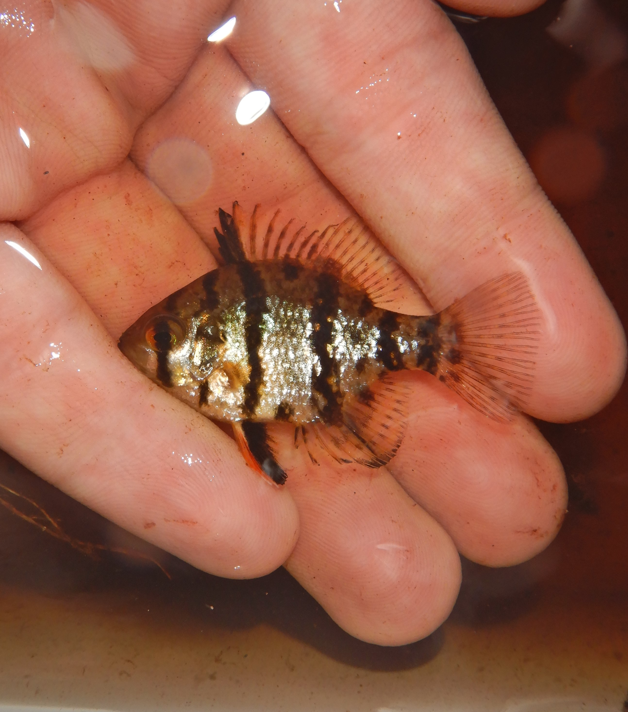

# kary-portfolio
a quick portfolio showing off my art and nature photography

<section id="Fishes">
  <h2>Fishes</h2>
  

    <!-- Add your art images here -->
    
    
  

</section>
<section id="insects">
  <h2>Insect Photography</h2>
  

      <!-- Add your insect photos here -->
    
    
  

</section>
